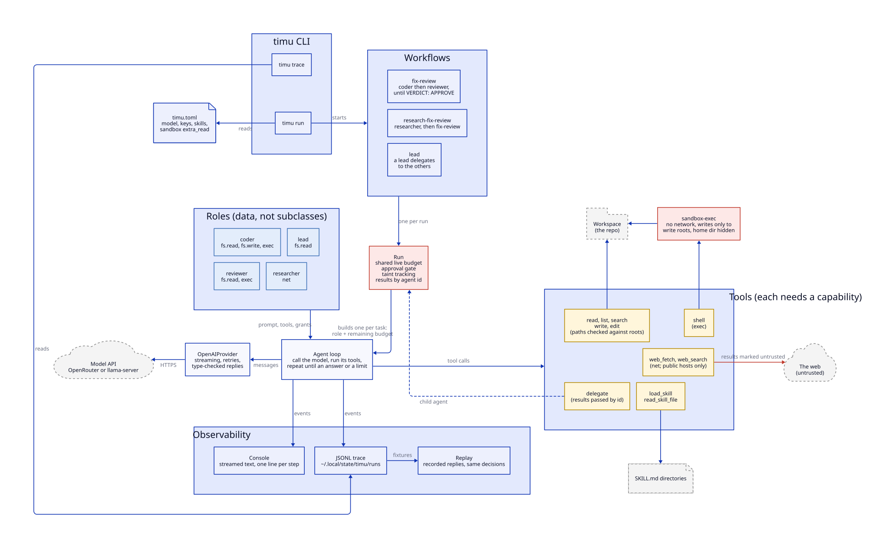

# timu

**timu**—Swahili for *team*—brings together specialised LLM agents, each with a defined role that determines its prompt, tools, and permissions. Workflows coordinate these roles to achieve a shared objective.

Status: alpha. The design is in `docs/dev/design.md`.

## Architecture



The source is `docs/media/architecture.d2`. `make diagrams` regenerates the SVG.

## Roles

| Role | Can | Cannot |
|-|-|-|
| `lead` | read the workspace, delegate to the others | write files, run commands |
| `researcher` | search and fetch the web | touch the workspace |
| `coder` | read, write and edit files, run commands | reach the network |
| `reviewer` | read files, run tests, return a report | change the code |

No role holds network access together with the ability to write files or run commands. Web content, and anything derived from it, reaches other agents only as marked, untrusted data. See design section 6.

## Requirements

- Python 3.11 or later. No runtime dependencies.

- macOS, for the `shell` tool's sandbox (`sandbox-exec`). Elsewhere, roles that run commands refuse to start unless you pass `--unsafe-no-sandbox`.

- An OpenAI-compatible model API: OpenRouter by default, or a local server such as llama-server.

- Optional: a Brave Search API key in `BRAVE_API_KEY`, so the researcher can search as well as fetch.

## Install

```sh
uv sync            # from a checkout; `make help` lists the other targets
uv run timu --help
```

## Configure

timu reads `./timu.toml`, else `~/.config/timu/timu.toml`. A minimal file:

```toml
[provider]
model = "openai/gpt-6-luna"              # an OpenRouter model id
# base_url = "http://127.0.0.1:8080/v1"  # a local server instead
# api_key_env = ""                       # a server without a key

[sandbox]
extra_read = ["~/.local/share/uv/python"]  # toolchains under $HOME
```

The API key comes from `OPENROUTER_API_KEY`, or the variable `api_key_env` names. `TIMU_MODEL` and `TIMU_BASE_URL` override the file. `src/timu/config.py` documents every key, including per-role models, skills and the search key.

The sandbox hides `$HOME` from commands. List any toolchain that lives there, such as uv's Python, in `extra_read`, or commands that use it fail.

## Run

```sh
timu run "make test fails; fix calc.py"
timu run --workflow research-fix-review "upgrade to the current tomllib API"
timu run --workflow lead "add a --json flag to the report command"
```

| Workflow | Agents |
|-|-|
| `fix-review` (default) | coder, then reviewer; repeats until approved or `--max-rounds` (default 3) |
| `research-fix-review` | researcher first, then `fix-review` |
| `lead` | a lead that delegates to the other three as it sees fit |

The reviewer's report goes to `REVIEW.md`, or `--report PATH`. Add it to `.gitignore`; timu warns if it is not ignored.

Useful flags:

- `--max-cost USD` stops the run at a spending limit. All agents share one budget.

- `--approve-untrusted` asks on the terminal before web content reaches the coder. It is on by default for `lead`. Without a terminal the answer is no; pass `--no-approve-untrusted` for unattended runs.

- `-v` shows every tool result.

Exit codes: 0 approved or done, 1 failed or refused, 2 usage error, 3 budget spent, 130 interrupted. Press Ctrl-C once to stop after the current step, twice to abort.

## Traces

Every run writes a JSONL trace to `~/.local/state/timu/runs/`, outside the workspace.

```sh
timu trace              # the latest run: agent tree, status and cost
timu trace <run id>
```

## Develop

```sh
make qa                 # lint, format check, typecheck, tests
TIMU_LIVE=1 make test   # also the live tests; billed against the configured model
```

The live tests are skipped by default. With `TIMU_KEEP_TRACES=tests/fixtures/traces`, the CLI live tests save their traces as replay fixtures, with local paths and your username replaced by placeholders. `make test` replays every fixture there.
